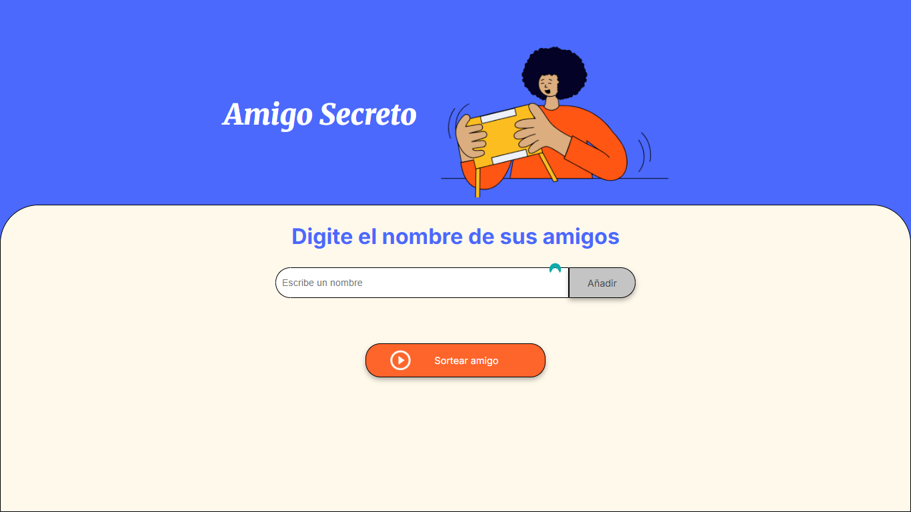

# Proyecto Amigo Secreto 🎉

  
*Una imagen de cómo se ve la página web.*

---

## 📌 Índice
- [¿Qué es este proyecto?](#-qué-es-este-proyecto)
- [¿Cómo funciona?](#-cómo-funciona)
- [¿Cómo probarlo?](#-cómo-probarlo)
- [Tecnologías que usé](#-tecnologías-que-usé)

---

## ❓ ¿Qué es este proyecto?
Es una página web sencilla que hice para practicar JavaScript. Sirve para:

- Añadir nombres de amigos a una lista.
- Hacer un sorteo aleatorio para elegir un "amigo secreto".

Lo hice porque quería aprender cómo funcionan los botones, las listas y los mensajes en una página web.

---

## 🖱️ ¿Cómo funciona?
### Para añadir un amigo:
1. Escribes el nombre en el cuadro de texto.
2. Le das al botón "Añadir".
3. ¡El nombre aparece en la lista abajo!

### Para sortear:
1. Cuando tengas varios nombres en la lista.
2. Le das al botón "Sortear amigo".
3. ¡Te dirá quién es el elegido!

**Importante:** Si el cuadro de texto está vacío, saldrá un mensaje de error.
  
---

## 🚀 ¿Cómo probarlo?
1. **Descarga los archivos** (HTML, CSS, JS).
2. Abre el archivo `index.html` con tu navegador (Chrome, Firefox, etc.).
3. ¡Listo! Empieza a añadir nombres.

*No necesitas instalar nada más.*

---

## 💻 Tecnologías que usé
- **HTML**: Para crear los botones, textos y la estructura de la página.
- **CSS**: Para hacerlo bonito (colores, fuentes, diseño).
- **JavaScript**: Para que los botones hagan cosas (añadir nombres, sortear).

## 💻 Estado del proyecto
🟢 **Completado**  
*El proyecto está finalizado, pero se aceptan sugerencias para nuevas funcionalidades.*